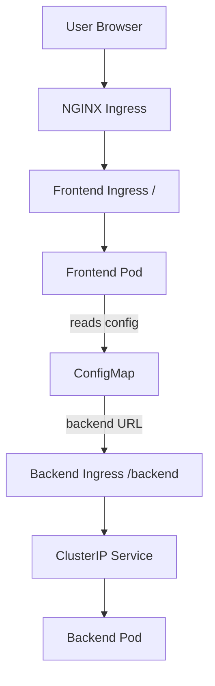

# Kubernetes Pipeline Setup Notes

## Prerequisites Before Running Pipeline

- AKS is provisioned with:
  - Monitoring enabled via Helm in Terraform
  - NGINX Ingress controller installed

- Azure DevOps connections configured:
  - DockerHub connection (`dockerhub_connection` - can be changed in pipeline)
  - AKS connection (`kube` - can be changed in pipeline)

## Directory Structure
backend/ # port 3000

frontend/ # port 3000

kube/

├── backend/ # Backend Kubernetes configs

├── base/ # Contains namespace 'a2' (if changed, update pipeline too)

└── frontend/ # Frontend Kubernetes configs

## Kubernetes Configuration Details

### Backend Configuration (`kube/backend`)
- `backend_deploy.yml`: Deployment for backend with two pods
- `backend_ingress.yml`: Ingress for backend with path `/backend(/|$)(.*)`
- `backend_cluster_ip.yml`: Service for backend with ClusterIP (80:3000)
- `kustomization.yaml`: References all backend YAML files

### Frontend Configuration (`kube/frontend`)
- `configmap.yml`: ConfigMap for both backend and frontend (!Important!)
- `frontend_deploy.yml`: Deployment for frontend with one pod
- `frontend_ingress.yml`: Ingress for frontend with path `/(.*)`
- `frontend_cluster_ip.yml`: Service for frontend with ClusterIP (80:3000)
- `kustomization.yaml`: References all frontend YAML files

### Base Configuration (`kube/base`)
- `namespace.yml`: Defines the `a2` namespace
- `kustomization.yaml`: References base YAML files

### Root Kustomization (`kube/kustomization.yaml`)
- References all backend, frontend, and base configurations

## Architecture Flow

Click to view Diagram

  

Important Notes

    The namespace in base is a2 - must match pipeline configuration

    ConfigMap contains configuration for both frontend and backend

    Frontend service communicates with backend via the ClusterIP service

